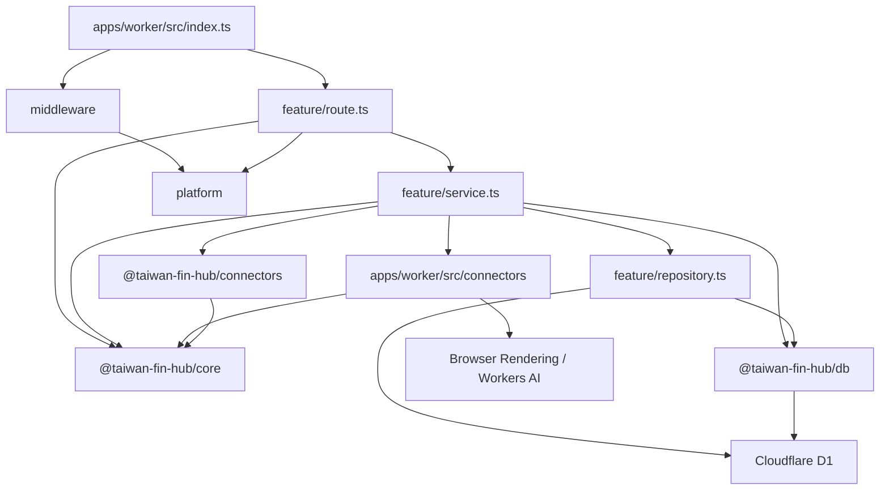
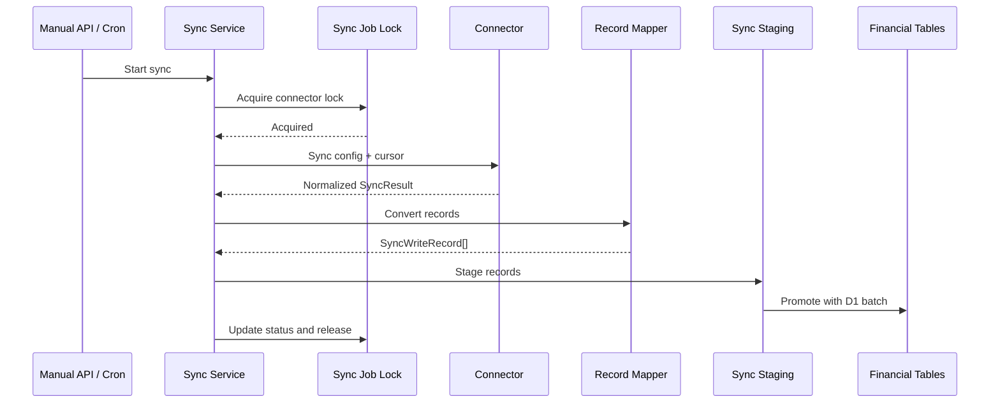

# 後端架構與維護約定

後端執行於 Cloudflare Workers，使用 Hono 提供 API，並透過 Cloudflare D1、Browser Rendering、Workers AI、Cron Triggers 與 Queues 完成資料儲存、銀行登入、驗證碼辨識及排程同步。

目前後端採用 **feature-oriented Vertical Slice Architecture**。程式依業務功能分組，而不是將所有 Controller、Service、Repository 分別集中在全域目錄。

`apps/worker/src/index.ts` 是 Composition Root，只負責：

- 建立 Hono application。
- 註冊全域 middleware。
- 組裝各 feature routes。
- 設定統一錯誤處理。
- 提供前端靜態資源。
- 接收 Cloudflare scheduled event 與 Queue message batch。

入口檔不得放置 SQL、connector 實作或具體商業流程。

## 整體結構

```text
apps/
├── web/
└── worker/
    ├── src/
    │   ├── index.ts
    │   ├── features/
    │   │   ├── activity/
    │   │   ├── activity-notes/
    │   │   ├── activity-roles/
    │   │   ├── bank/
    │   │   ├── cards/
    │   │   ├── classification/
    │   │   ├── connectors/
    │   │   ├── dashboard/
    │   │   ├── exchange-rates/
    │   │   ├── inbox/
    │   │   ├── investments/
    │   │   ├── invoices/
    │   │   ├── manual-assets/
    │   │   ├── merchants/
    │   │   ├── net-worth/
    │   │   ├── notifications/
    │   │   ├── ocr/
    │   │   ├── own-accounts/
    │   │   └── sync/
    │   ├── connectors/
    │   ├── middleware/
    │   └── platform/
    └── tests/

packages/
├── core/
├── connectors/
└── db/
    └── migrations/
```

## 相依方向



基本原則：

- `route.ts` 不直接撰寫 SQL。
- `repository.ts` 不處理 HTTP request、status code 或 Hono `Context`。
- `service.ts` 不回傳 Hono `Response`。
- feature 不得依賴其他 feature 的 `route.ts`。
- 跨 feature 的 service 呼叫應保持明確，避免形成循環相依。
- 不為了符合形式而建立空的 Service 或 Repository。
- 不建立通用 `BaseRepository` 或過度抽象的資料存取層。

## Feature 內部結構

複雜 feature 通常採用以下結構：

```text
features/<feature>/
├── route.ts
├── service.ts
├── repository.ts
└── 其他只屬於此 feature 的檔案
```

不是每個 feature 都必須包含全部三個檔案。簡單查詢可以只有 `route.ts` 與 `service.ts`；沒有資料庫操作時不需要建立 `repository.ts`。

### `route.ts`

HTTP adapter，負責：

- 宣告 API path 與 HTTP method。
- 定義 request schema。
- 使用 Zod 驗證 body、query 與 path parameters。
- 從 Hono `Context` 取得 binding、parameter 與已驗證資料。
- 呼叫 service。
- 將預期的 service error 轉換成 HTTP status 與穩定 error code。
- 組裝 response 與 pagination headers。

不應負責：

- 直接執行 SQL。
- 實作分類、計算或同步流程。
- 處理 connector protocol。
- 執行大型資料轉換。

### `service.ts`

Use case 與商業流程層，負責：

- 組合一個完整 use case。
- 執行商業驗證與計算。
- 協調 repository、connector 與其他 service。
- 控制資料同步流程。
- 定義可預期且可由 route mapping 的 error class。
- 將 repository row 轉換成 API 所需資料。
- 管理時間、ID、加密、cursor 與同步狀態。

Service 可以直接接受 `D1Database` 或 `Env`，不需要額外建立 Dependency Injection container。

若程式只是單純資料查詢，應維持簡單，不需要套用 DDD Aggregate、Value Object 或 Command Bus。

### `repository.ts`

Feature 專用的 D1 存取層，負責：

- 集中該 feature 使用的資料存取。
- 一般 CRUD 與查詢組合預設使用 `@taiwan-fin-hub/db` 的 Drizzle schema／client。
- 執行 query、insert、update、delete 與 upsert。
- 回傳 database row、affected row count 或存在性結果。
- 在仍需原生 statement 時，建立供 service 組合的 `D1PreparedStatement`。

過渡期 repository／service 仍接受 `D1Database`，在 repository 內呼叫 `createDrizzle(binding)`，不另建 DI container，也不建立跨 request／Queue invocation 的全域 client。TypeScript property 使用 camelCase，並明確對應既有 snake_case 欄位；回傳給 service／API 的 shape 由 selection 或 mapper 維持，不把 `$inferSelect` 當成 runtime validation。

複雜 expression、CTE、條件 upsert、跨檔案組成的原生 D1 batch，或轉換後無法保留語意的路徑，可繼續使用參數化 raw SQL，並在呼叫處註明原因。同一 batch 不得混用不相容的 Drizzle query object 與 `D1PreparedStatement`。

Repository 不應：

- 接收 Hono `Context`。
- 回傳 HTTP response。
- 決定 HTTP status code。
- 呼叫外部銀行或政府 API。
- 包含與資料存取無關的商業流程。

SQL 應放在使用它的 feature 附近。只有確實被多個 feature 共用的資料存取能力，才放入 `@taiwan-fin-hub/db`。

## 共用目錄責任

### `apps/worker/src/platform/`

Cloudflare Worker 與 HTTP 平台層，目前包含：

- Worker bindings 與 Hono binding types。
- Hono factory。
- API error response。
- Demo 唯讀模式。
- Cursor pagination 工具。
- Zod validation hook。
- Cloudflare Access JWT 驗證。
- 設定與加密工具。

`platform` 不得依賴任何具體 feature。

### `apps/worker/src/middleware/`

跨 route 的 HTTP middleware：

- `accessMiddleware`：驗證 Cloudflare Access 身分；Demo 模式略過登入。
- `demoReadOnlyMiddleware`：Demo 模式只允許安全的唯讀 method。
- `connectorContextMiddleware`：驗證 connector ID，並寫入 Hono variables。

Middleware 應只處理跨功能的 request concern，不應承擔 feature 商業邏輯。

### `apps/worker/src/connectors/`

需要 Cloudflare Worker bindings 的 connector adapter，例如：

- Browser Rendering。
- Puppeteer browser lifecycle。
- Workers AI。
- Worker-specific session management。

這些 connector 可以使用 `BROWSER` 或 `AI` binding，並將外部資料轉成 `@taiwan-fin-hub/core` 定義的標準資料格式。

### `packages/connectors/`

不直接依賴 Hono、D1 或 Worker `Env` 的外部資料來源程式，包括：

- Connector config schema。
- 外部 API client。
- Protocol signing、encryption 與 parsing。
- Response normalization。
- 不需要 Worker binding 的 connector。
- 可獨立執行的 synthetic self-check。

若 connector 必須使用 Browser Rendering，通用的 config、parser 與型別仍放在此 package，Worker-specific browser adapter 則放在 `apps/worker/src/connectors/`。

### `packages/core/`

前端、Worker、database 與 connector 共用的穩定契約，包括：

- 金融資料型別。
- Connector interface。
- `ConnectorId` 與支援清單。
- Sync result。
- API success/error contract。

不得將 Hono `Context`、D1 row 或 Puppeteer object 放入 core contract。

### `packages/db/`

真正跨 feature 使用的 D1 基礎能力，目前主要包括：

- `createDrizzle(binding)`：以當次 request／Queue 的 D1 binding 包成 Drizzle client，關閉 query／parameter logging。不是連線池或 DbContext。
- `src/schema/`：依業務領域描述現有業務表；SQL migrations 仍是 schema 權威。
- Connector settings（Drizzle CRUD，保留既有 ID、建立時間與 sync cursor）。
- `sanitizeDatabaseError(error)`：在設定存取、API 與通知 log 邊界移除 Drizzle query error 的 SQL、綁定參數及 cause。
- 加密設定與 sync cursor 狀態。
- Sync job、schedule 與 lock。
- D1 migrations。

Drizzle 型別只留在 DB 與 Worker repository 層。`packages/core`、前端與 `packages/connectors` 不依賴 ORM。日期維持既有 TEXT string，金額與 JSON／flag 語意不因導入而改寫。

Feature-specific 查詢應放在 feature 的 `repository.ts`，而不是持續擴大 `packages/db/src/index.ts`。一般 repository 以 Drizzle 為預設寫法；sync job、run／item、排程、通知批次及報告的一般讀取，以及同步 lease 與獨立 run 狀態更新已使用 Drizzle。selection 維持既有 row shape、排序與 LEFT JOIN null；staging promotion 與 durable item 寫入的 statement composition 保留整組原生 D1 batch。

分類 repository 已轉換為 Drizzle；規則重排維持單一 batch，保留 NOCASE 分類唯一性、系統規則保護與 override conflict target。invoices、investments 與 bank 的一般列表／明細查詢已轉換為 Drizzle，保留游標分頁、LEFT JOIN null、pending／posted 可見性與 TEXT 日期邊界；銀行交易日條件維持可使用 `idx_bank_transactions_transaction_day`。dashboard、net-worth、activity 與 bank calculation／search 聚合已轉換為 Drizzle，保留計算值、跨來源去重、TEXT 日期與 activity search CTE；同步 lease／run 狀態更新以 Drizzle 保留單次條件 UPDATE 與 affected rows 判斷；staging promotion 保留原生 batch 的順序、計數 offset、finalize／cursor／cleanup 原子邊界。保留 SQL 的範圍與測試見下方維護約定。

資料庫 schema 與預設資料必須透過：

```text
packages/db/migrations/
```

管理，不得由 `GET` API 在執行期間自動建立，也不得對正式環境使用 `drizzle-kit push`。Schema 比對測試以 migration 重播結果為準；隔離 D1 整合測試使用 Miniflare／workerd binding，不連線正式資料庫。

### Drizzle 與原生 SQL 維護約定

一般 CRUD、篩選與 JOIN 優先使用 Drizzle；不為統一語法重寫已有測試的穩定 SQL。
複雜 CTE、window function、set-based upsert 或跨檔案組合的 D1 batch，
以可讀性與保留原子性為準，保留原生 SQL 並註明理由。

| 保留範圍                                            | 原因與主要驗證                                                                                                                                                                                                                |
| --------------------------------------------------- | ----------------------------------------------------------------------------------------------------------------------------------------------------------------------------------------------------------------------------- |
| staging JSON upsert、promotion 與 lifecycle 合併    | 保留批次參數數量、ENTITY_ORDER、count offset、cursor／finalize／cleanup 的同一 batch。`persistence.test.ts`、identity migration tests、`preference-fk-reconciliation.test.ts`、`drizzle-runtime.test.ts` 驗證資料保留及回滾。 |
| einvoice／TDCC durable item 寫入與 create-or-get    | 保留 item claim、JSON merge、計數、設定版本 CAS 及 partial unique conflict 處理。run repository 與 sync service tests 驗證重送與結案。                                                                                        |
| schedule／notification batch／report 寫入及財務 CTE | 保留固定成員快照、notification claim、報告修復及跨資產最新值／缺幣計算。notification batch、report repository 與 scheduler tests 驗證。                                                                                       |

Lease acquisition／renewal 維持單次條件 UPDATE 與 affected rows 判斷，
不得拆成 SELECT 後 UPDATE；不得用循序 await 或 Promise.all 取代原子 batch。
查詢調整須保留 expression index 的可用性，以既有 EXPLAIN QUERY PLAN 測試確認。

SQL migrations 是 schema 權威，由 Wrangler 管理套用與 migration ledger；
不導入 Drizzle Kit 生成／套用 migration 流程。現有 Kit devDependency 僅供
`packages/db/tests/schema.test.ts` 的隔離 schema 比對，不使用 push 同步資料庫。
比對須涵蓋 FK、CHECK、generated column、nullable、default、unique 與索引語意。

Drizzle repository 整合測試使用 `packages/db/testing/d1.ts` 的 Miniflare／workerd D1，
驗證回傳 shape、NULL、排序及 batch 回滾；既有 SQLite adapter 僅用於其能正確模擬的測試。
直接 import Drizzle 的 workspace 應自行宣告相依，不依賴 npm hoisting。

### 交易與發票偏好的參照完整性

`bank_transaction_preferences.transaction_id` 與
`invoice_transaction_preferences` 的 `invoice_id`／`transaction_id` 使用 FK，
刪除策略為 `NO ACTION`。合併資料須在同一 batch 先移轉或明確處理偏好，再刪除舊資料；
不得以 CASCADE 或自動清空交易 ID 抹除 linked／separate 決策。
玉山 lifecycle shadow、永豐及華南 legacy 比對與台新即時消費取代共用 `transaction-merge.ts`：
僅合併雙向唯一對應且發票配對、計算偏好、分類覆寫、經濟角色覆寫（`economic_role`）不衝突的交易。
在同一 promotion batch 移轉偏好、角色覆寫與交易引用後才刪除舊交易，保留決策及時間；
兩端相同的計算／分類／角色偏好保留新版既有資料；兩筆互標為重複的角色覆寫在合併後清除重複標記。
候選 SQL 內含銀行資料時以 bindings 傳入，不拼接字串。無對應、配對歧義或偏好衝突時，
保留原交易及設定；華南亦不再直接清除沒有對應的 legacy 資料。

0045 套用前須唯讀查核以下三種孤兒引用（包含 separate 的非 NULL transaction_id）：

```sql
SELECT 'bank_transaction_preferences.transaction_id' AS reference, COUNT(*) AS orphan_count
FROM bank_transaction_preferences p
WHERE NOT EXISTS (SELECT 1 FROM bank_transactions t WHERE t.id = p.transaction_id)
UNION ALL
SELECT 'invoice_transaction_preferences.invoice_id', COUNT(*)
FROM invoice_transaction_preferences p
WHERE NOT EXISTS (SELECT 1 FROM invoices i WHERE i.id = p.invoice_id)
UNION ALL
SELECT 'invoice_transaction_preferences.transaction_id', COUNT(*)
FROM invoice_transaction_preferences p
WHERE p.transaction_id IS NOT NULL
  AND NOT EXISTS (SELECT 1 FROM bank_transactions t WHERE t.id = p.transaction_id);
```

有孤兒引用時先檢視來源與使用者決策，不自動刪除或補造父資料。
0045 以完整複製保留偏好及時間；有違規時 migration transaction 失敗回滾。
遠端套用前另確認 0044 的 NULL PK 前置條件、備份及隔離升級驗證。

### 交易自關聯

0046 為 `bank_transactions.transfer_peer_id` 與 `matched_transaction_id` 新增
指向同表 `id` 的 `NO ACTION` FK，並新增 transfer peer 索引；matched transaction
原有 partial unique index 保留。允許 NULL 與自我引用，不使用 CASCADE／SET NULL，
避免刪除父交易時改變 pending 可見性或定存計算排除。

Migration 在同一 transaction 暫存並重建兩張引用交易的 preferences 表，
保留所有交易、偏好、時間、generated column 及原有索引。孤兒引用會使升級回滾，
不自動補造父交易或清空配對。套用前備份並唯讀查核：

```sql
SELECT 'transfer_peer_id' AS reference, COUNT(*) AS orphan_count
FROM bank_transactions t
WHERE t.transfer_peer_id IS NOT NULL
  AND NOT EXISTS (SELECT 1 FROM bank_transactions p WHERE p.id = t.transfer_peer_id)
UNION ALL
SELECT 'matched_transaction_id', COUNT(*)
FROM bank_transactions t
WHERE t.matched_transaction_id IS NOT NULL
  AND NOT EXISTS (SELECT 1 FROM bank_transactions p WHERE p.id = t.matched_transaction_id);
```

一般 transaction promotion 以同一 statement 寫入交易及 transfer peer；永豐在
promotion 後更新授權配對，中信刪除副本前處理 matched reference，共用合併流程先移轉
兩種引用。未來若將相依交易拆成不同 statements，須先寫入被引用交易，
或在同一 batch 明確延後 FK 檢查並驗證回滾；同一 batch 本身不保證可任意排列。

### 交易對手帳戶與「我的其他帳戶」

`bank_transactions.counterparty_bank_code`／`counterparty_account_suffix` 保存來源可辨識的
轉帳對方（三碼代碼與帳號末五碼，CHECK 限制不得存完整帳號），由 connector 的
`counterpartyAccount` 經 record mapper 與 staged persistence 寫入；0049 以相同規則回填
國泰世華既有交易。代碼表與推導、遮罩、比對工具集中在 `packages/core` 的 `taiwan-banks.ts`。

`features/own-accounts/` 提供 `GET/POST /api/own-accounts` 與
`PUT/DELETE /api/own-accounts/:id`，只接受三碼代碼、末 4–5 碼、種類與選填名稱；
重複的代碼＋末碼回傳 `409 OWN_ACCOUNT_EXISTS`，不存在回傳 `404 OWN_ACCOUNT_NOT_FOUND`。

比對在 `bank/service.ts` 的 `presentBankTransactions` 讀取時套用，不改寫交易或偏好，
所以新增、修改或刪除自有帳戶會回溯影響所有月份的活動、搜尋與收支統計。
同代碼且交易末五碼以登記末碼結尾才相符（信用卡帳戶的交易不比對），多筆相符取末碼較長者。
計算優先順序為：個別交易計算偏好（`bank_transaction_preferences`）→ 自有帳戶種類 →
分類規則的排除設定 → 預設卡費排除。`own_account` 一律排除收支，分類在沒有
個別覆寫、商家規則或使用者規則時標示為「轉帳」（`source = own_account`，`categoryId = other`）；
`unsynced_card` 代表看不到消費明細的卡片，轉入款項一律計入支出，分類標示為「繳卡費（名稱）」、
轉出為「卡片退款（名稱）」（`source = unsynced_card`，`categoryId = other`）。
帳戶互轉與年費減免的自動配對仍優先於自有帳戶分類。只有銀行名稱沒有帳號的轉帳
（如「轉帳 台新銀行 轉存款」）不做推測比對，需以分類規則或個別交易排除。

### 活動經濟角色與月收支 summary

每筆銀行／信用卡交易與電子發票都有讀取時推導的經濟角色，推導函式集中在
`packages/core` 的 `economic-role.ts`（純函式）。與自有帳戶比對相同，角色不改寫交易或發票，
規則、分類或自有帳戶變動後過去月份自動重算；只有使用者 override 存在
`activity_role_overrides`（0054）。

- `economicRole`：`spending`（消費，信用卡退款以正數沖減）、`income`、`own_transfer`
  （自有帳戶互轉、電支儲值，以及被排除計算且沒有其他角色依據者）、`investment`、
  `card_payment`（繳已同步信用卡：銀行端扣款與卡片端繳款入帳）、`excluded`（「不計入」：
  沒有實際付款、已退款作廢、測試等；0063 起）。`excluded` 只來自使用者 override 或作廢發票，
  分類規則與商家規則不能指定（`RULE_ECONOMIC_ROLES`，API 回 400）。
- `reviewStatus`：`auto`／`confirmed`（使用者 override、個別計算設定、發票配對決策）／
  `needs_review`。與角色正交。
- `duplicateOf`：`{ kind: "bank_transaction" | "invoice", id }` 或 `null`；重複的活動仍列出，
  但不計入任何金額。
- `investmentEventKind`：`buy`／`sell`／`dividend`／`null`。銀行端只以文字判斷股利；
  投資交易明細以交易名稱判斷；無法可靠判斷時為 `null`。
- `roleReason`：判定依據（`override`、`calculation_preference`、`own_account`、`unsynced_card`、
  `auto_transfer`、`card_payment`、`possible_unsynced_card`、`ewallet_topup`、`merchant_rule`、`rule`、
  `category`、`excluded`、`sign`、`invoice`、`invoice_matched`、`invoice_ambiguous`、`invoice_awaiting_card`、
  `invoice_voided`、`trade`），只供說明與除錯。`roleReason = excluded` 是舊的「不計入收支」設定
  （角色為 `own_transfer`），與 `excluded` 角色無關。

銀行／信用卡交易的推導順序（先符合者為準）：

| 順序 | 條件                                                                               | 角色                                                             | reviewStatus                                   |
| ---: | ---------------------------------------------------------------------------------- | ---------------------------------------------------------------- | ---------------------------------------------- |
|    1 | 使用者 override                                                                    | override 指定                                                    | `confirmed`                                    |
|    2 | 個別交易設為「不計入」                                                             | 繳卡費文字或信用卡繳費規則 → `card_payment`，其餘 `own_transfer` | `confirmed`                                    |
|    2 | 個別交易設為「計入」                                                               | 規則角色 `investment` → `investment`，其餘依正負                 | `confirmed`                                    |
|    3 | 對方為「我的其他帳戶」`own_account`                                                | `own_transfer`                                                   | `auto`                                         |
|    3 | 對方為 `unsynced_card`                                                             | `spending`（看不到該卡明細，繳款即消費）                         | `auto`                                         |
|  3.5 | 商家規則（`merchant_aliases.economic_role`）                                       | 商家規則指定（`roleReason = merchant_rule`）                     | `confirmed`                                    |
|    4 | 帳戶互轉自動配對（`auto_transfer`）                                                | `own_transfer`                                                   | `auto`                                         |
|    4 | 信用卡端正數且為繳款文字（非退款／回饋）                                           | `card_payment`                                                   | `auto`                                         |
|    4 | 存款端 `system:bank:creditcard-payment` 或預設繳卡費文字，發卡銀行有已同步的信用卡 | `card_payment`                                                   | `auto`                                         |
|    4 | 存款端繳卡費，推不出發卡銀行或該行沒有已同步的信用卡                               | `card_payment`（`roleReason = possible_unsynced_card`）          | `needs_review`                                 |
|    4 | `system:bank:ewallet-topup`                                                        | `own_transfer`                                                   | `auto`                                         |
|    4 | 規則角色 `investment`（如 `system:bank:investment-keywords`）                      | `investment`                                                     | `auto`                                         |
|    4 | 規則角色 `income` 或收入子類分類（`income.*`，如薪資）                             | `income`                                                         | `auto`                                         |
|    4 | 其他規則角色（`own_transfer`、`spending`）                                         | 規則指定（`roleReason = rule`）                                  | `auto`                                         |
|    5 | 其他 `excludedFromCalculation`（定存互轉、分類規則排除、年費減免配對等）           | `own_transfer`                                                   | `auto`                                         |
|    6 | 其餘：存款正數 `income`；負數與信用卡正數（退款）`spending`                        | 依正負                                                           | 符合轉帳提示規則時 `needs_review`，否則 `auto` |

存款端繳卡費的發卡銀行先取交易對手銀行代碼，否則從描述與對方名稱找唯一提到的銀行
（`taiwanBankCodeFromText`，含「國泰」「中信」等俗稱；提到多家視為無法判斷）。已同步的發卡銀行
取自仍在同步的信用卡帳戶：`bank_code`、連接器對應代碼（`CONNECTOR_BANK_CODES`）或機構名稱。
已在「我的其他帳戶」登記為 `unsynced_card` 的對方仍依順序 3 算 `spending`。

已配對發票的商家規則角色在活動層合併到交易（以發票的商家 key 為準），順位與 3.5 相同。

電子發票：已與交易配對者 `duplicateOf` 指向該交易（金額以交易為準，使用者手動連結時
`confirmed`）；使用者選「分開記錄」者為 `spending`／`confirmed`；其餘未配對發票為 `spending`。
候選分數差距不足（`ambiguous`），或 ±3 天內有同金額、仍計為消費且未配對的 TWD 支出時，
標為 `needs_review`（`invoice_ambiguous`）。信用卡載具發票等待刷卡交易時為
`invoice_awaiting_card`，超過 10 天才 `needs_review`。電支儲值是移轉、國外交易服務費不是消費本體，
都不作為發票的重複候選。同一筆消費重複開立的外幣發票（見下節「重複開立」），沒對到付款的那幾張
`duplicateOf` 指向代表這筆消費的發票（`kind = invoice`）、`needs_review`（`invoice_repeat`），不計入金額。
override 沒有指定 `duplicateOf` 時保留推導出的重複關係（重複開立亦同，override 只確認角色）；
要讓已配對或重複開立的發票單獨計算，使用發票配對的「分開記錄」。配對規則見下節。

作廢發票：`invoices` 讀取時由 raw 取出財政部狀態 `invoiceStatus`（`$.detail.invStatus`，其次
`$.invStatus`、`$.invoice.invStatus`）。`isVoidedInvoiceStatus` 判定：沒有狀態視為有效；含「作廢」
「註銷」「撤銷」「退回」（或 void／cancel）者，以及不含「開立」「確認」「正常」這類有效字樣的狀態，視為作廢。
作廢發票自動為 `excluded`（`roleReason = invoice_voided`、`reviewStatus = auto`、`matchStatus = unmatched`），
不參與配對與歧義判斷（不會吃掉同額的刷卡交易）；使用者 override 仍可改回其他角色。

### 發票與刷卡／銀行交易去重

同一筆消費可能同時出現在信用卡（或存款帳戶）與電子發票；summary 只能算一次。配對在讀取時
推導（`packages/core` 的 `activity-matching.ts` `matchInvoicesToTransactions` 與
`invoice-dedupe.ts` `resolveInvoiceDedupe`），不寫入資料庫，刷卡交易晚到時下次讀取自然合併。

候選：手動連結與「分開記錄」優先；其餘只考慮仍計為消費（`economicRole` 為 `spending` 或未推導）、
未排除計算的 TWD 交易，排除電支儲值與國外交易服務費。同日完全同額可用任何消費（含信用卡未入帳的
正數授權）；跨日與非同額只接受負數支出。一般視窗 ±3 天（搜尋 0 天）。

評分（原始分數最高 1.3，回報的 `matchScore` 除以 1.3 正規化為 0–1；常數 `INVOICE_MATCH_SCORE`）：

| 項目 | 條件                                                                                                                                     | 分數             |
| ---- | ---------------------------------------------------------------------------------------------------------------------------------------- | ---------------- |
| 金額 | 完全相同                                                                                                                                 | 0.5              |
| 金額 | 國外商家匯差（信用卡、差額 ≤ max(NT$30, 5%)、拉丁品牌相符）                                                                              | 0.3              |
| 金額 | 點數折抵：實付 < 發票、實付 ≥ 發票 80%、差額 ≤ NT$500，且商家強相符或信用卡載具                                                          | 0.3              |
| 日差 | 同日／1 天／2 天／3 天以上                                                                                                               | 0.3／0.2／0.1／0 |
| 商家 | `merchant-similarity.ts`：統編出現在描述、拉丁品牌（含別名）相符或中文名稱互相包含／共同子字串 ≥ 4 字為強；≥ 2 字且佔較短名稱 40% 為部分 | 0.2／0.1         |
| 載具 | 發票載具是這筆交易的已同步信用卡                                                                                                         | 0.3              |

外幣發票（`invoices.currency` 不是 TWD，見「外幣發票」）另走 `scoreForeignCurrencyEdge`，不適用上表的
完全同額與國外商家匯差：只與信用卡支出配對，刷卡日在發票日（台北時間）−1～+5 天
（`FOREIGN_INVOICE_DAYS_BEFORE`／`_AFTER`，搜尋 0 天），商家須相似（`merchant-similarity.ts`，例如
`Cloudflare Inc.` ↔ `CLOUDFLAREA3906`，none 不配），且

- 台幣刷卡：發票原幣以 `exchange_rates` 換算後，與刷卡金額相差 ≤ max(5%, NT$1)
  （`FOREIGN_INVOICE_AMOUNT_RATIO`，涵蓋匯率時間差與發卡行匯率；國外交易服務費另列一筆）；
  缺該幣別匯率時不自動配對；
- 同幣別的外幣刷卡：直接比原幣，相差 ≤ 1%（`SAME_CURRENCY_AMOUNT_RATIO`）。

金額以近似計 0.3，加上日差、商家與載具分數，沿用下述一對一指派。

重複開立：跨境電商偶爾對同一筆消費開出多張相同發票、只扣款一次。`invoiceRepeatGroups` 把同一賣方
（統編，否則正規化名稱）、同品項描述（`itemsKey`，raw `detail.details[].description` 依序串接、
NFKC／小寫／空白正規化）、同幣別與原幣金額、且在該組第一張 24 小時內（`INVOICE_REPEAT_WINDOW_HOURS`）的
外幣發票分成一組。只看外幣發票：國內發票常有同一家店隔天買同樣東西（每天一杯相同的飲料），不能視為
重複開立。選「分開記錄」的發票不入組。每組先只讓第一張參與配對，配到後才讓下一張找下一筆付款
（真的付了兩次時都配得到）。其餘發票的配對結果為 `repeat`：`matchStatus = ambiguous`（前端顯示
「疑似重複」）、`roleReason = invoice_repeat`、`duplicateOf` 指向已配對的那張（沒有付款紀錄時指向第一張，
第一張照常計入消費），summary 計入 `duplicateExcluded`，收件匣列為 `duplicate_ambiguous`。

一對一指派：每輪只看最高分且差距小於 `INVOICE_MATCH_MIN_MARGIN`（0.1）的候選邊，兩端都唯一者配對。
同日、完全同額、分數相同且為完全二分圖的一群（描述也無從區分）依 id 順序配對，因任何配法金額都相同；
其他衝突兩端都保留未配對，發票為 `ambiguous`。結果與輸入順序無關。

信用卡載具：發票的 `carrier_type` 不是手機條碼／自然人憑證／悠遊卡／一卡通（`NON_CARD_CARRIER_TYPES`），
且 `carrier_suffix` 為 4 位數字並等於某張已同步信用卡帳戶的 `account_last4` 時，該發票只與這張卡的交易配對，
日差視窗放寬到 5 天（入帳日可能晚於消費日）。因此載入範圍前後各多 `INVOICE_MATCH_CONTEXT_DAYS`（10）天。

`matchStatus`（`InvoiceMatchInfo`，另帶 `matchedTransactionId`、`matchScore`、`carrierCardSuffix`、`awaitingOverdue`）：

| matchStatus     | 意義                                                                                     | 金額                           |
| --------------- | ---------------------------------------------------------------------------------------- | ------------------------------ |
| `matched_card`  | 與信用卡交易合併（含手動連結）                                                           | 以刷卡為準，發票 `duplicateOf` |
| `matched_bank`  | 與存款帳戶交易合併                                                                       | 以交易為準，發票 `duplicateOf` |
| `awaiting_card` | 信用卡載具，但該卡交易尚未出現；超過 10 天（`INVOICE_AWAITING_CARD_DAYS`）`needs_review` | 暫時計入消費                   |
| `unmatched`     | 沒有候選（現金、未同步的付款方式），或使用者選「分開記錄」                               | 計入消費                       |
| `ambiguous`     | 有候選但無法唯一決定，`needs_review`                                                     | 暫時計入消費                   |
| `ambiguous`     | 重複開立（`invoice_repeat`）：同一筆消費的另一張發票已代表付款，`needs_review`           | 不計入，發票 `duplicateOf`     |

刷卡／銀行交易以 `matchedInvoiceId` 指回發票。`awaiting_card` 逾期以台北時間今天計算。

外幣發票：財政部明細對跨境電商發票帶 `detail.currency`（例如 USD），`invoices.amount` 與清單 API 金額是
截斷成整數的原幣（US$10.98 存成 10）。0066 以 virtual generated column 推導 `invoices.currency`（三碼
英文字母，其餘為 TWD）與 `invoices.original_amount`（`detail.amount`）。`invoices/service.ts` 以
`preciseInvoiceAmount` 決定原幣金額：明細總額有小數時採用（含品項外的稅額，例如品項 US$5、總額 US$5.25）；
明細總額也是整數時，品項金額加總有小數且截斷後一致者採用加總；其餘沿用總額或 `amount`。發票 DTO 帶
`currency`、原幣 `amount` 與 `itemsKey`。活動項目的外幣發票 `amount`／`currency` 為原幣，另帶
`amountTwd`（`exchange_rates` 換算、四捨五入到分，缺匯率為 `null`；銀行／信用卡項目也帶，TWD 等於
`amount`）；已配對外幣發票的刷卡項目以換算後台幣填 `invoiceAmount`，另帶 `invoiceCurrency` 與
`invoiceOriginalAmount`。summary、分類排行、匯出以台幣換算值計算，缺匯率時列入 `missingCurrencies`
（重複項目不計入金額，缺匯率也不影響完整性）；收件匣與商家列表的金額以 `amountTwd` 換算。

國外交易服務費的歸屬（`foreign-fee.ts` `attributeForeignTransactionFees`，活動層推導、不合併交易也不改
金額）：費用列（「國外交易服務費－479.00」「國外交易手續費」）找同一張卡、日期相差 ≤ 2 天的台幣支出：
描述帶原交易金額時金額須相等；沒有金額時以 1.5% 推算，四捨五入後相差 ≤ NT$1。多筆候選只留描述沒有
中文者；唯一時費用列帶 `foreignFeeOf`（原消費交易 id），並沿用原消費的分類（`categorySource = rule`）。
使用者或商家規則指定的分類、原消費未分類，以及找不到或有歧義時，費用維持原分類（手續費）。

`features/activity-roles/` 提供 override API：`GET /api/activity/role-overrides`、
`PUT /api/activity/role-overrides/:targetKind/:targetId`（body：
`{ "economicRole": "own_transfer", "duplicateOf": { "kind": "bank_transaction", "id": "…" } | null, "note"?: string | null }`）與
`DELETE` 同路徑。`economicRole` 可為 `excluded`（`activity_role_overrides` 的 CHECK 於 0063 以重建表放寬，
保留既有資料）。`note` 一併寫入活動備註（空字串或 `null` 刪除、省略不變更），回應另帶寫入後的 `note`。`targetKind` 只接受 `bank_transaction`／`invoice`；活動或 `duplicateOf` 不存在回傳
`404 ACTIVITY_NOT_FOUND`／`404 DUPLICATE_ACTIVITY_NOT_FOUND`，指向自己回傳 `400`，刪除不存在的
override 回傳 `404 ACTIVITY_ROLE_OVERRIDE_NOT_FOUND`。

`bank/service.ts` 的 `presentBankTransactions` 在每筆交易加上角色欄位（含 override），所以
`GET /api/bank` 與以它建構的活動列表都帶角色；`GET /api/activity/search` 的發票也套用推導與
override（搜尋只載入命中的日子，發票歧義判斷與配對一樣限同日，已配對發票仍併入交易顯示）。

`activity/summary-service.ts` 提供：

- `GET /api/activity/summary?month=YYYY-MM`、`?from=YYYY-MM&to=YYYY-MM`（最多 12 個月）或
  `?months=N`（1–12，以台北時間本月為終點）；未帶參數時為本月。回傳 `{ months: ActivityMonthSummary[] }`。
- `GET /api/activity/items?month=YYYY-MM`：該月活動（含角色；已配對發票以 `duplicateOf`
  列為獨立項目；投資交易明細為 `investment`）與該月 summary。發票項目帶 `matchStatus`、
  `matchedTransactionId`、`matchScore`；銀行／信用卡項目帶 `matchedInvoiceId`、`matchScore`。
  交易頁「總帳」分頁使用此 API。
- `GET /api/activity/sources?month=YYYY-MM&source=bank|card|invoice`：交易頁「銀行／信用卡／發票」
  分頁。回傳 `{ month, source, records, sourceCounts, dedupe, complete, incompleteReasons }`；
  `records` 為該來源的活動項目（`ActivitySourceRecord`，發票另帶 `carrierType`、`carrierSuffix`、
  `carrierCardSuffix`、`awaitingOverdue`），已合併的發票也列出；`sourceCounts` 為三個來源的筆數。
- `GET /api/activity/export?from=YYYY-MM&to=YYYY-MM`（最多 12 個月，`export-service.ts`）：給 LLM 分析用的
  精簡 JSON `{ from, to, currency, generatedAt, months, items }`。`months` 為每月 `ActivityMonthSummary`；
  `items` 每筆為 `{ date, source, amountTwd（帶正負號，缺匯率為 null）, currency, originalAmount?,
displayName, categoryId, categoryLabel, categorySource, economicRole, reviewStatus, note, itemsPreview,
account }`。不含內部 id、帳號、卡號與 raw：`account` 只由機構與帳戶名稱組成，分段卡號與 5 碼以上的
  連續數字改為「…末四碼」（「末五碼 12345」改為「末四碼 2345」）。已配對發票的重複項目與投資交易明細不列。

summary 只計入銀行、信用卡與發票；投資交易明細（集保、券商）只列示，金流以銀行端交割為準。
載入範圍前後各多 `INVOICE_MATCH_CONTEXT_DAYS` 天以完整配對跨月邊界的發票，月份以台北日期歸屬。
各欄位以 TWD 計：`income`、`spending`（消費淨額）、`investment`（投資淨流出）、`ownTransfer` 與
`cardPayment`（流出總額，流入不另計）、`saved = income − spending`、`needsReview`（筆數與絕對金額，
仍計入其角色欄位）、`duplicateExcluded`（重複而不計入的絕對金額）、`excludedAmount`／`excludedCount`
（`excluded` 角色的絕對金額與筆數；這些活動不計入任何其他欄位，包含 `needsReview`、`duplicateExcluded`、
`activityCount`、`dedupe` 與缺匯率判斷，但列表仍回傳）、`spendingByCategory`（頂層消費分類
id → 消費淨額，未分類為 `other`、使用者自訂分類歸入 `misc`）、`spendingBySubcategory`（指定的分類 id，
子類或只分到頂層時的頂層 id → 消費淨額）、`activityCount`，以及 `dedupe`（依發票日期歸月的
`invoicesMerged`、`invoicesUnmatched`、`invoicesAwaitingCard`、`invoicesAmbiguous`；沒有 `matchStatus`
的舊項目以 `duplicateOf`／`needs_review` 推得）。外幣以 `exchange_rates` 換算，缺匯率時該筆不計入並列出
`missingCurrencies`。`incompleteReasons` 列出不完整的原因，有任何原因時 `complete = false`：
`missing_exchange_rates`（缺匯率）、`classification_unavailable`（分類規則載入失敗，角色只能依正負）、
`role_overrides_unavailable`（override 載入失敗，未套用）、`own_accounts_unavailable`（自有帳戶載入
失敗）。資料載入問題套用到該次查詢的所有月份；`bank/service.ts` 的 `loadBankRange` 回報這些問題，
`GET /api/bank` 維持原本的回應形狀。沒有角色欄位的舊項目沿用既有口徑（不計入者視為移轉，
其餘依正負）。淨流入不作為主要數字，也不計算預算。

### 活動備註

`activity_notes`（0063）保存使用者對單筆活動（`bank_transaction`／`invoice`）的備註，讓自己與 LLM 知道
原因（例如「跟朋友A買人民幣，存富邦華一」「GoDaddy SSL 自動續約，實際未扣款」）。與 override 相同是多型參照、
不設 FK，備註不影響任何金額。`features/activity-notes/` 提供：

- `PUT /api/activity/notes/:targetKind/:targetId`，body `{ "note": string }`：前後空白去除、換行統一為 `\n`，
  最多 1000 字；空字串刪除並回傳 `{ targetKind, targetId, note: null }`。活動不存在回 `404 ACTIVITY_NOT_FOUND`，
  超過字數或 `targetKind` 不合法回 `400 INVALID_REQUEST`。
- `DELETE` 同路徑：不存在回 `404 ACTIVITY_NOTE_NOT_FOUND`。
- `GET /api/activity/notes?month=YYYY-MM`：該月活動的備註（帶活動的台北日期 `date`）；省略 `month` 列出全部。

活動列表（`/api/activity/items`、`/api/activity/search`、`/api/activity/sources`、`/api/bank` 的交易）由
`merchants/annotate.ts` 批次載入備註，每筆帶 `note`（沒有為 `null`）與 `noteTarget`（備註實際存放的活動）。
已配對的交易與發票共用備註：自身沒有時沿用另一方；編輯時仍以活動自身為目標。活動搜尋的候選日 SQL 與
`activitySearchHaystack` 都比對備註文字。

### 商家模型與消費分類

分類只描述「錢花在哪」：收入、轉到自己帳戶、投資與繳卡費由經濟角色表達，不是分類。
分類 id、名稱、emoji 與顏色的正本在 `packages/core` 的 `categories.ts`，資料庫
`classification_categories` 以相同 id 供 FK 參照（0055）。

- 消費分類只有 9 個頂層、沒有子類（0067 併成 9 類，2026-09 使用者回饋「分類太多太細，不知道選哪個」，並依使用者要求加入「捐款」）：
  `food` 🍜 餐飲（餐廳、便當、飲料、咖啡、超市、超商）、`transport` 🚇 交通（大眾運輸、計程車／叫車、油資、停車）、
  `housing` 🏠 居住（房租房貸、水電瓦斯、電信網路）、`shopping` 🛍️ 購物（日用品、服飾、網購）、
  `tech` 💻 3C 數位（3C 硬體、AI 訂閱、SaaS、雲端、網域、軟體）、`entertainment` 🎬 娛樂（電影、遊戲含 Steam、
  影音串流訂閱、旅遊）、`health` 🩺 醫療保險（醫療、藥局、保險）、`donation` 🙏 捐款（基金會、慈濟、家扶、世界展望會等）、`misc` 📌 其他（人情紅包、稅、手續費、
  學習進修、現金提領與其他無法歸類）。頂層本身就是完整的分類。收入子類 `income.salary`、`income.investment`、
  `income.other` 保留，只在收入角色使用，不出現在消費分類選單。`other` 是「未分類」（沿用舊 id），不是「其他」。
- 顏色依實體固定、不依排名：8 個有色分類依序使用已驗證類別色板的 8 色（`validate_palette`：淺色相鄰
  CVD ΔE 9.1、深色 8.4，皆通過），`misc`、`other` 與收入使用中性灰（`color.neutral = true`），圖例與排行必須
  有文字標籤。
- 0067 遷移：舊 id 全部對到 9 類——`food.*`→`food`、`transport.*`→`transport`、`housing.*`→`housing`、
  `shopping.*`→`shopping`、`tech.*`→`tech`、`lifestyle` 與 `lifestyle.subscriptions`、`lifestyle.entertainment`、`lifestyle.travel`→
  `entertainment`、`lifestyle.education`→`misc`、`health.*`→`health`、`social.donations`→`donation`、
  `social`／`social.gifts`、`fees*`、`misc.*`→`misc`，
  0055 以前遺留的 `education`／`fee`／`tax`→`misc`、`software`→`tech`、`insurance`→`health`、`utilities`→`housing`。
  `donation` 在 0067 建立（舊捐款引用直接落在 `donation`）；0069 只做冪等補齊（與「捐款」撞名的自訂分類
  改名並留紀錄、`donation` upsert、`misc` 排序），不改動任何商家規則或覆寫，使用者選「其他」的商家維持不變。
  涵蓋 `classification_overrides`、`classification_rules`（含系統規則）、`merchant_aliases` 與
  `classification_migration_notes.new_category_id`，再刪除舊分類列。
  summary 的 `spendingBySubcategory` 保留（指定的分類 id → 消費淨額），系統分類沒有子類後與
  `spendingByCategory` 相同，只有使用者自訂分類（`user:*`，在 `spendingByCategory` 歸入 `misc`）會分開列出。
- 0055 遷移：舊 `salary` → `income.salary`、`software` → `tech.software`；`transfer`／`investment` 的個別覆寫改寫成
  `activity_role_overrides`（`own_transfer`／`investment`，既有角色覆寫優先），使用者規則改為
  `economic_role` 規則；其餘舊系統分類對應到新 id 後刪除（未知的舊系統分類歸入 `misc`，`needs_attention = 1`）。
- 自訂分類（`is_system = 0`）在 0055、0067、0069 一律保留 id、名稱與所有引用（覆寫、規則、商家規則），
  成為自訂消費分類；只有與新系統分類撞名（NOCASE）者加註「（自訂）」（仍撞名再附 id），
  並寫入 `subject_type = 'category'` 的紀錄（`legacy_label` 原名、`new_label` 新名）。
- 系統規則在 0055 換成新版預設時保留使用者的調整：`enabled = 0` 沿用到同 id 與接替的拆分規則
  （例如 `system:bank:food-keywords` → `system:shared:drinks-keywords`／`dining-keywords`），`priority`
  與上游預設不同者保留；pattern 不是任何歷史上游預設者視為使用者改過，同 id 規則保留使用者的
  pattern（連同 field／operator），被移除的規則轉為使用者規則 `user:legacy-<舊 id 去掉 system:>`；
  兩者都寫入 `rule-pattern:<舊 id>` 紀錄（`legacy_pattern` 為保留的 pattern，`new_pattern` 為未套用的新版預設）。
- 以上紀錄都在 `classification_migration_notes`（`needs_attention = 1` 為需人工處理），
  由 `GET /api/classification/migration-notes` 讀取。
- 規則：`classification_rules.category_id` 與 `economic_role` 可只填其一，`amount_direction`
  限制只套用流入或流出。繳卡費（`system:bank:creditcard-payment`）、電支儲值
  （`system:bank:ewallet-topup`）與投資為角色規則；`system:bank:transfer-keywords` 沒有分類也沒有角色，
  作為「轉帳提示」。`target_type` 為 NULL 的規則也套用於發票賣方名稱；覆寫的 `target_type` 可為
  `bank_transaction` 或 `invoice`。

商家 key 由 `packages/core` 的 `merchant.ts` 在讀取時推導：

- 發票有賣方統編時為 `ban:<8 碼統編>`（`invoices.seller_ban` 為 0056 由 raw payload 推導的
  virtual generated column，同步流程不變），否則為 `name:<正規化名稱>`。
- 銀行／信用卡：對方名稱優先，描述只有「信用卡消費」等通路字樣時改用另一欄。正規化包含 NFKC
  （全形轉半形）、去除「電支交易」與電支序號、6 位以上數字、「股份有限公司／有限公司／(股)」之後的
  分公司與門市字樣、尾端「門市／分店／店」（店種如「咖啡店」「早餐店」保留）與空白後的地名；
  英文刷卡描述只保留「BRAND *第一個明細字」；最後轉小寫並移除空白與標點。LINE Pay
  「連支＊X」「連加＊X」取 X 為商家並標記 `merchantPaymentMethod = line_pay`（街口、全支付同理）。
- 已配對的交易以發票的 key 為準（活動層計算）；交易自身的 key 仍用於別名與規則的次要比對。

`merchant_aliases`（0056）保存使用者的顯示名稱與商家規則。分類與角色即為商家規則，與角色推導相同，
在讀取時回溯套用到該商家所有活動，不改寫交易。分類優先序：個別覆寫 → 商家規則 → 使用者規則 →
系統規則 → 未分類；已配對的交易與其發票各自解析後取可信度較高者（同分時以發票賣方為準，個別覆寫
仍以交易為準），發票重複項目沿用交易的最終分類。

`features/merchants/` 提供：

- `GET /api/merchants?query=&months=3`：以活動列表同一套 key 彙總近 N 個月（1–12，預設 3）的
  筆數、TWD 消費淨額、最常見分類、付款方式與別名；另列出有別名但近期沒有活動的商家。
- `GET`／`PUT`／`DELETE /api/merchants/:merchantKey`（key 須 URL 編碼）。`PUT` body：
  `{ "displayName"?: string | null, "categoryId"?: string | null, "economicRole"?: role | null }`，
  省略的欄位保留原值；分類不存在回傳 `404 CATEGORY_NOT_FOUND`，刪除不存在者回傳 `404 MERCHANT_NOT_FOUND`。
- `POST /api/activity/categorize`：`{ targets: [{ kind, id, categoryId?, merchantKey? }], categoryId?,
applyToMerchant? }`，同一 D1 batch 寫入。`applyToMerchant = false` 寫入個別覆寫（`categoryId = null`
  移除覆寫）；`true` 時寫入商家規則並移除這些活動的個別覆寫。活動不存在回傳 `404 ACTIVITY_NOT_FOUND`。

活動列表（`/api/activity/items`、`/api/activity/search`、`/api/bank` 的交易）由
`merchants/annotate.ts` 以批次查詢（別名、品項、發票分類、覆寫歷史各一次）加上：
`merchantKey`、`displayName`（別名，否則清理後名稱）、`merchantName`（清理後名稱）、
`merchantPaymentMethod`、`itemsPreview`（發票或已配對發票前 3 個品項，去除條碼、數量與單位、折扣行）、
`categoryId`（新體系）、`categorySource`、`suggestedCategoryId`、`suggestionSource`、`note` 與 `noteTarget`。
`/api/bank` 為此載入交易日期前後 6 天的發票完成配對。

分類建議只提供給未分類（或只分到有子類的系統頂層分類，建議其子類；0067 起只有收入有子類）的消費與收入，重複、互轉、
自有帳戶與未同步卡片不提供。來源優先序：`merchant_history`（同商家個別覆寫最多的分類）→
`merchant_keywords`（`category-suggestions.ts` 的台灣常見商家關鍵字）→ `item_keywords`（品項關鍵字，
依金額加權、需占 40% 以上）→ 需依品項細分的商家（超商、百貨）的預設分類。`ai` 保留為來源值，
本版未實作。

`merchant_history`、`merchant_keywords`、`item_keywords` 的建議在讀取時直接成為 `categoryId`
（`AUTO_APPLY_SUGGESTION_SOURCES`），`suggestedCategoryId`／`suggestionSource` 仍保留作為說明。
`categorySource` 表示最終分類的來源：`user`（個別覆寫，含已配對發票的覆寫）→ `merchant_rule` →
`rule`（使用者規則與系統規則）→ `auto_suggestion`（自動套用的建議，前端標「自動」）→ `none`（未分類）。
個別覆寫、商家規則與使用者規則在建議之前決定分類，因此不會被自動建議取代。發票重複項目沿用交易的 `categorySource`。
summary 的 `spendingByCategory` 以套用後的分類計算。

商家關鍵字（皆對到 8 類）另涵蓋：飲品、飲料、茶飲、手搖、咖啡、豆花、冰（排除冰箱、冰櫃）、食堂、小吃、麵、飯、餐、
便當、早餐、鍋、燒肉、壽司、拉麵、牛排（排除牛排刀）、麥當勞、肯德基、摩斯、漢堡王、Popeyes、Subway、星巴克、路易莎、
cama、85度C → `food`（排除餐具、餐桌、餐椅、餐券、飯店、電鍋／電子鍋、鍋具、麵粉）；全家、7-ELEVEN、萊爾富、OK
等超商依品項判斷，判斷不出時為 `food`。付款平台排在所有品牌之前：Apple.com/bill、App Store、Google Play、
TradingView、Trend Micro／趨勢科技 → `tech`；LINE禮物 → `misc`（人情）。Steam 等遊戲平台 → `entertainment`。
無卡提款、ATM 提款、跨行提款與「提款」（不含提款卡、提款機）→ `misc`（現金提領，錢的去向未知）。

活動搜尋（`GET /api/activity/search?q=`）比對原始文字、商家別名（別名對應的統編與名稱）、發票品項
名稱，並支援金額語法：`125`（金額等於或文字包含）、`>1000`、`>=`、`<`、`<=`、`=`、`100-200`，
可與文字並用（如 `咖啡 >100`），金額以絕對值比較。解析在 `packages/core` 的 `activity-search.ts`，
候選日期的 SQL 與前端篩選共用同一語法。

### 信用卡帳單與繳款狀態

`features/cards/` 提供信用卡頁 API，契約型別在 `packages/core` 的 `cards.ts`。帳單與繳款狀態都在
讀取時由 `credit_card_bills`、最新餘額快照與交易角色推導，不寫入任何資料。

- `GET /api/cards/summary`：依發卡行（信用卡帳戶的 `connector_id`，例如 `cathaybk`）分組。
  每組回傳本期帳單 `currentBill`（`billingPeriod`、`statementBalance`、`minimumPayment`、
  `paymentDueDate`、`statementClosingDate`、`paidAmount`、`remainingAmount`、`paymentStatus`、
  `minimumPaid`、`payments`、`daysUntilDue`）、未出帳 `unbilled`（`since`、`amount`、
  `pendingAmount`、`transactionCount`、`missingCurrencies`）、各卡 `cards`、資料來源 `source`
  （`mode = sync | manual_import`、最近成功時間與狀態）、`lastUpdatedAt`，以及
  `estimated`／`estimatedReasons`。頂層另有 `totals`（TWD 本期應繳、尚未繳、未出帳）與最近一個
  未繳清的截止日 `nextDue`。
- `GET /api/cards/:issuer/bills`：該發卡行近 12 期帳單（新到舊），每期同樣帶繳款狀態。
  `issuer` 不符格式回傳 `400 INVALID_REQUEST`，沒有該發卡行的信用卡回傳 `404 CARD_ISSUER_NOT_FOUND`。

帳單合併：同一發卡行同一期以 TWD 帳單為主（中信另有外幣帳單），多個帳戶的同期帳單金額相加。
國泰多卡共用一張帳單，帳單與繳款掛在摘要帳戶 `credit:cathaybk:main`，消費掛在各實體卡帳戶；
台新、中信多卡共用一個帳戶，依帳戶 raw 的卡片清單（`cardLast4s`、`cards`）列卡，交易以 raw 的
`cardLast4` 歸卡。應繳金額依序取帳單總額 → 同一結帳日的餘額快照應繳 → 上期結帳日之後到本期
結帳日的刷卡淨額（標示 `statement_from_transactions` 推估）。

繳款配對：結帳日之後（歷史帳單到下一期結帳日為止）`economicRole = card_payment` 的交易，
信用卡端為發卡行帳戶上的正數繳款入帳，存款端為負數扣款且由對方銀行代碼或描述推得的發卡銀行
（`cardPaymentIssuerCode`）與發卡行相同。存款端扣款與卡片端入帳是同一筆錢，兩端分別加總後取
較大者，再與來源提供的已繳金額取較大者，不相加。

| 狀態      | 條件                                                                                      |
| --------- | ----------------------------------------------------------------------------------------- |
| `paid`    | 應繳 ≤ 0、來源標示已繳清（`is_paid = 1` 或結帳後快照 `no_payment_needed`）、或已繳 ≥ 應繳 |
| `partial` | 已繳 > 0 但小於應繳                                                                       |
| `unpaid`  | 看得到應繳金額，結帳日之後沒有任何繳款                                                    |
| `unknown` | 應繳金額不明且來源沒有已繳旗標                                                            |

中信帳單的已繳金額取自「下一期」摘要的 `pmtAmt`（本期間繳掉的上期帳單），應繳以 `currPmtAmt` 優先；
0064 把舊版解析器寫入的資料位移成相同結果（每期 `paid_amount` ＝ 同帳戶同幣別下一期的舊值，
最新一期為 NULL，`statement_amount` 以 raw 的 `currPmtAmt` 修正），0061 拆分帳戶時把指向舊
`credit:ctbc:<幣別>` 的 `canonical_account_id` 改指同幣別摘要帳戶（防禦性退回台幣摘要帳戶，
都不存在時維持原值並保留舊帳戶）。

`is_paid = 0` 不視為未繳證據（國泰最新一期以「本期不需繳款」表示）。未出帳為上期結帳日隔天起、
信用卡帳戶上 `economicRole = spending` 的交易淨額（退款沖減、含待入帳），已入帳交易以入帳日
歸期；不知道結帳日時自本月 1 日起算（`closing_date_unknown`）。中信只能半自動匯入，一律標示
`manual_import` 推估。`excluded` 角色的交易不計入未出帳、推估帳單與繳款（這些計算只看 `spending`／
`card_payment`）。各卡 `activityFilter`（帳戶名稱、`source=card`、未出帳起日）供前端組成
交易頁連結；多卡共用帳戶時只能篩到整個帳戶（`activityFilterExact = false`）。

### 待處理收件匣

`features/inbox/` 提供 `GET /api/inbox`，契約型別在 `packages/core` 的 `inbox.ts`。回傳
`{ counts: { blocking, tidy }, months, items, unavailable }`；每項為
`{ id, kind, severity, title, detail, target: { view, query? }, createdAt, action?, amount?, currency?, count? }`，
blocking 在前，同級依 kind 與時間排序。`id` 在資料未變動前保持穩定，供前端記住已讀或略過。

| kind                          | severity | 條件                                                                            |
| ----------------------------- | -------- | ------------------------------------------------------------------------------- |
| `connector_needs_user_action` | blocking | 已設定來源的同步工作 `last_status = needs_user_action`（驗證碼、OTP、裝置驗證） |
| `connector_error`             | blocking | 已設定來源的同步工作 `last_status = failed`；同一來源多個 scope 取最近一筆      |
| `card_due_unpaid`             | blocking | 信用卡本期帳單未繳或部分繳，且 7 天內到期（逾期 31 天內仍列出）                 |
| `ctbc_import_stale`           | blocking | 中信已設定或已有帳戶，`ctbc` 同步工作超過 7 天沒有成功（或從未成功）            |
| `needs_review`                | tidy     | 本月與上月 `reviewStatus = needs_review` 的活動（發票歧義除外），逐筆列出       |
| `duplicate_ambiguous`         | tidy     | 本月與上月 `roleReason = invoice_ambiguous` 的發票，逐筆列出                    |
| `uncategorized`               | tidy     | 本月與上月 `categorySource = none` 的銀行／信用卡消費，彙總成一項並帶 `count`   |

計數與活動類項目只看台北時間本月與上月，避免舊資料永遠清不掉。`excluded` 角色的活動不列入任何活動類
項目；自動套用分類建議的消費不算未分類。`target.view` 為前端 hash 路由名稱
（`data-sources`、`cards`、`activity`），`target.query` 為該頁可理解的 hash query（例如
`{ connector }`、`{ issuer }`、`{ month, uncategorized: "1" }`、`{ month, activity: "bank:<id>" }`）。
同步、信用卡或活動任一來源載入失敗時，其餘項目仍回傳，失敗來源列在 `unavailable`。

### 淨資產歷史與存款每日推算

`features/net-worth/` 維護 `net_worth_history` 的銀行存款列（`source = 'bank'`、`asset_type = 'deposit'`，
每日一列）。某日的值為每個存款帳戶（排除信用卡與 `canonical_account_id` 已合併帳戶）取
`substr(as_of_at, 1, 10) ≤ 該日` 的最新 `bank_balance_snapshots` 加總，外幣以目前匯率換算、
沒有匯率的外幣略過。重算時一次載入快照並在記憶體內逐日計算（`computeBankDepositSeries`），
結果與 `calculateBankDepositValue` 相同；整段範圍只需一次查詢加分批 upsert。

第一次同步前沒有快照，因此由交易明細推算每日日終餘額（`backfill.ts` 為純計算、repository 負責寫入）：

- 錨點為帳戶最早一筆真實快照；推算區間從「所有可推算帳戶中最早的交易日」到錨點前一日（台北日期），
  不早於錨點往前 `BANK_SYNC_MONTHS` 個月與開戶日。錨點之後的交易不影響推算，錨點當天只有日期的交易視為發生在錨點之前。
- 交易 raw 帶交易後餘額（`balance`、`balanceAfter`、`balanceAmt`、`Balance`、`acctBal`）且每筆都有時，
  取當日鏈終點的餘額（`running_balance`），沒有交易的日子延續前一日，第一筆交易之前用其交易前餘額。
- 否則以錨點倒推（`reverse_sum`）：`balance(D) = 錨點 − Σ(D 之後、錨點之前的交易)`；沒有任何交易的帳戶即為錨點值。
- 兩者都能算時逐日交叉驗證，差額超過 1（原幣最小單位）的日子改用倒推值，並以
  `net_worth_backfill_cross_check_mismatch` 記錄帳戶末四碼與日期（不記金額）。
- 只推算明細完整的連接器：`esun`、`cathaybk`、`obank`、`kgibank`、`skbank`、`firstbank` 同步會抓存款明細，
  沒有交易即代表餘額未變動。`ctbc`（網銀匯入可能取不到存款明細，且沒有逐帳戶保存明細是否完整）
  與其他只抓總覽或信用卡的連接器（例如 `hncb`）一律跳過；交易幣別與快照不同的帳戶也跳過。
  跳過的帳戶自第一次真實快照起才計入總額。

推算值寫成 `bank_balance_snapshots`：`source_id = derived-balance:YYYY-MM-DD`、
`as_of_at = YYYY-MM-DDT15:59:59.000Z`（台北 23:59:59）、raw 為 `{ derived: true, method }`。
推算日期一律早於錨點，所有「最新快照」查詢都不受影響；upsert 只更新推算列，並刪除不在新區間內的舊推算列，
重跑冪等，真實快照永遠優先且不會被覆蓋或刪除。

觸發點：

- 每次同步寫入餘額後（`refreshBankDepositHistory`）：先推算，再把存款歷史從最早快照日重算到今天（台北日期），
  沒有同步的日子延續最後已知餘額。推算失敗只記錄 `net_worth_backfill_failed`，仍會重算歷史。
- `POST /api/history/net-worth/backfill`：手動執行同一流程，回傳各帳戶末四碼、狀態、區間、天數、方法與交叉驗證結果，不含金額。
  `POST /api/history/net-worth/rebuild-bank` 保留，未指定 `to` 時同樣算到今天。
- Cron 每次觸發（`ensureScheduledBankDepositHistory`）：今天還沒有存款歷史點時，從最後一點隔天補到今天；
  已有今天的點只花一次查詢，demo 模式不執行。

`GET /api/history/net-worth/chart` 的存款列若日期不晚於最後一個推算日，帶 `derived: true`，
前端據此標示「M/D 以前的存款餘額由交易明細推算」。走勢目前只有存款、集保回傳的股票／基金歷史與手動資產；
不以集保交易紀錄加現價反推過去的投資部位（會把目前價格套到過去，造成誤導）。

## HTTP Request 流程

所有 API 掛載在 `/api`：

```text
Request
  → Cloudflare Access middleware
  → Demo read-only middleware
  → Connector context middleware（適用時）
  → Feature route
  → Feature service
  → Repository / Connector
  → JSON response
```

非 `/api` 路徑交由 `ASSETS` binding 提供前端靜態檔案。

## Request 驗證

外部輸入應優先使用 Zod 驗證：

```ts
api.post(
  "/example",
  zValidator(
    "json",
    requestSchema,
    validationHook("INVALID_REQUEST", "Request data is invalid."),
  ),
  async (c) => {
    const input = c.req.valid("json");
    return c.json(await executeUseCase(c.env.DB, input));
  },
);
```

約定：

- JSON body 使用 `zValidator("json", ...)`。
- Query string 使用 `zValidator("query", ...)`，或共用 pagination parser。
- 有固定集合或格式限制的 path parameter 使用 `zValidator("param", ...)`。
- 不得將未驗證的 request body 直接傳入 service 或 SQL。
- Client 不應依賴 Zod 的原始錯誤文字；API 應回傳穩定 error code。

## API 錯誤格式

API error 統一為：

```json
{
  "success": false,
  "error": {
    "code": "ERROR_CODE",
    "message": "Human-readable message."
  }
}
```

錯誤處理分為兩類：

### 預期錯誤

例如：

- Resource not found。
- Duplicate resource。
- Connector 尚未設定。
- OTP 或 CAPTCHA 需要人工處理。
- 同一 connector 已有同步工作執行中。
- 外部 connector 暫時無法使用。

Service 應使用明確的 error class 表示，route 再映射成固定 HTTP status 與 error code。

### 未預期錯誤

未被 route 處理的錯誤交由全域 `api.onError`：

- 在 Worker log 記錄完整錯誤。
- Client 固定收到 `INTERNAL_ERROR`。
- 不得回傳原始 exception、stack trace、SQL 或敏感 connector response。
- 帳號、Cookie、token、OTP 與解密後 config 不得寫入 log。

只有已知且確認不包含敏感資料的 connector 錯誤，才可將經整理的 message 回傳給 client。

## Pagination

大型且持續新增的資料列表使用 cursor-based keyset pagination：

```http
GET /api/activity?limit=50&cursor=<opaque-cursor>
```

規則：

- `limit` 預設通常為 50。
- `limit` 最大值為 100。
- `cursor` 是不透明值，前端不得解析或自行產生。
- 查詢必須使用穩定且唯一的排序欄位組合。
- 不再為新 API 增加 `offset` pagination。

回應維持既有 JSON 資料格式，並使用 headers：

```http
X-Has-More: true
X-Next-Cursor: <opaque-cursor>
```

只有 `X-Has-More` 為 `true` 時，才需要回傳 `X-Next-Cursor`。

## Connector 同步架構

同步 feature 位於：

```text
apps/worker/src/features/sync/
```

主要責任如下：

- `route.ts`：手動同步 API 與 connector-specific 錯誤 mapping。
- `service.ts`：同步 use case、設定解密、connector 呼叫、lock 與流程協調。
- `record-mapper.ts`：將 connector result 轉換成 database write record。
- `persistence.ts`：透過 staging table 與 D1 batch 將同步資料寫入正式資料表。
- `repository.ts`：同步流程使用的 query 與 prepared statement。
- `ctbc-write.ts`：中信自動同步與網銀半自動匯入共用的寫入路徑（授權配對、promote、
  canonical 帳戶連結與存款歷史重建）。
- `ctbc-import.ts`：`POST /api/connectors/ctbc/import` 的 use case，以 `parseCtbcData`
  解析使用者自行登入網銀後取得的回應，在手動同步 lock 下寫入；不讀寫帳密與 cursor。
- `schedule-route.ts`：排程設定 API。
- `schedule-service.ts`：排程設定 use case。
- `scheduler.ts`：到期工作選取、預設排程批次與同步 dispatch。
- `scheduler-queue.ts`：Cron 啟動訊息、Queue consumer 與分段同步 continuation。
- `einvoice-sync-service.ts` / `einvoice-run-repository.ts`：電子發票 durable run 與明細工作。
- `tdcc-sync-service.ts` / `tdcc-run-repository.ts`：集保 durable run、分頁工作與結果彙整。

同步資料流：



Connector 可在 `SyncResult.warnings` 回報「同步成功但部分資料未取得」（例如來源暫時
忙碌而略過的明細）。一般同步將其帶入 `SyncOutcome.warnings`，手動與排程成功時由
`sync-warning.ts` 合併後寫入 `sync_jobs.last_error`，`last_status` 仍為 `success`；
沒有警告的成功同步會清除該欄位。

## 同步鎖與排程

同一個 connector 的不同同步 scope 共用 canonical connector lock，避免以下工作重疊：

- 手動同步與排程同步。
- 全部同步與部分同步。
- CAPTCHA preparation 與正式同步。

目前同步 lock：

- 單次 invocation 的手動與排程同步 lease 為 10 分鐘，執行期間每 2 分鐘續租。
  Invocation 若在 `finally` 之前被中斷，殘留鎖最多在一個 lease 後到期，之後即可重新同步。
- 電子發票與集保的 durable run 在 Queue chunk 之間沒有心跳，connector lock 維持
  30 分鐘 lease，由每個 chunk 開始時延長。
- 一般同步工作完成或失敗後必須在 `finally` 釋放。durable run 的 connector lock 跨 invocation 維持，由成功寫入或失敗結案流程釋放；每段另有 owner-scoped run lease。
- Lock acquisition 失敗時回傳或記錄「已有同步執行中」，不得平行執行同一 connector。

Cron trigger 只負責向 `SYNC_QUEUE` 送出 scheduler 啟動訊息。Queue consumer
每次 invocation 最多處理一個 connector，完成後若確實處理了工作便以 20 秒延遲送出下一個訊息，
避免連續啟動 Browser session 時撞上 Browser Run 的 acquisition rate limit；下一次 consumer
invocation 因此不必等待下一個 10 分鐘 Cron，且擁有獨立的 Worker CPU、subrequest 與執行時間額度。
初始 Cron kick 不延遲。Queue consumer 使用 batch size 1 與 concurrency 1，維持 connector
逐一執行。是否到期仍由 D1 sync job 狀態判斷；沒有可執行工作時 consumer 不再送出訊息，
結束本次串接。

Demo 模式（`DEMO_MODE`）不執行背景同步：Cron 不送出 scheduler 啟動訊息，Queue consumer
不處理任何訊息，避免啟用 Demo 前殘留的訊息繼續以已儲存的憑證登入外部服務。scheduler 啟動訊息
直接 ack；電子發票與集保分段訊息則以 1 小時延遲重新送出以保留 continuation，關閉 Demo 後會
重新嘗試處理進行中的 durable run。若期間 session 過期或設定變更，仍可能需要重新驗證或重新啟動同步。

電子發票不在單一 connector invocation 內擷取所有品項明細。它使用
`einvoice_sync_runs` / `einvoice_sync_run_items` 作為 durable work queue：手動或排程
建立 run 後 enqueue `run-einvoice-chunk`，每個 Queue invocation 最多 claim 並取得 35
張發票明細，並以 set-based D1 寫入完成整批；仍有 pending work 時再 enqueue continuation。品項明細一律同步，並非
`public_config`、HTTP request 或 catalog 可選的 `fetchDetails` 偏好。

電子發票 run 與 item 都以 owner-scoped rolling lease 防止 Queue delivery 重送時平行處理。
只有全部 item 成功後，service 才把 durable run items 當作 staging source，以固定五個
set-based D1 statements promotion 至正式表並更新 cursor；這個 batch 以設定版本 CAS 防止
憑證更新競態。後續 finalize path 更新 `sync_jobs`、排程批次結果與通知；`promoted_at` 讓
promotion 前後的重送皆可冪等。
暫時錯誤由 Queue retry，session 失效會清除 session 後重新初始化；需要使用者操作或重試
耗盡才將 run 結案為 `needs_user_action` 或 `failed`，不寫入部分完成的明細。

### 集保分段同步

集保的手動 API 與排程由 `startTdccSyncRun` 建立／取得 active run，再 enqueue
`run-tdcc-chunk`。`tdcc_sync_runs` 保存 scope、設定版本、加密認證與 session；
`tdcc_sync_run_items` 保存銀行與投資交易的分頁工作及結果。同一 connector 的
`all`、`investments`、`bank`、`trades` 共用 active run 限制與 canonical lock。

手動啟動會先初始化登入以回報 OTP 等互動需求；排程由 Queue 初始化且不主動寄送
OTP。API 的排入同步回應不代表全部資料已完成，前端須追蹤 sync job lifecycle。
每個 chunk 取得 owner-scoped run lease、更新 connector lock，最多 claim 一個
分頁 item；仍有 pending 或 processing work 時 enqueue 下一段。item 更新使用
claim token，chunk 的 `finally` 只釋放該 owner 的 run lease。

分頁結果完成後彙整並透過 `sync_write_staging` 與 staged persistence 寫入正式表，
寫入前檢查設定版本，並在 promotion batch 更新 connector 狀態、cursor 與 sync job。
後續處理排程結果、手動報告修復與 run 結案；`promoting`、`promoted_at` 用於辨識
promotion 與 finalize 的進度。暫時錯誤使用 Queue retry，需要互動或重試耗盡時結案。

## 同步結果通知

同步結果通知位於 `apps/worker/src/features/notifications/`，不放入 sync repository。

- `route.ts`：推播設定、裝置 subscription、偏好與測試通知 API。
- `service.ts`：VAPID 設定、subscription 加密、通知派送與失效 endpoint 清理。
- `repository.ts`：`push_subscriptions` 與 `notification_preferences` 的 D1 存取。
- `payload.ts`：將 sync status 轉成不含金融明細的安全通知內容。

排程同步更新 `sync_jobs` 後才呼叫通知 service。通知是 best-effort；發送失敗只記錄 log，不得將成功同步改成失敗。瀏覽器 subscription payload 使用既有設定加密金鑰保存。

使用預設排程（`schedule_mode = inherit`）的工作採「一輪一批次」。沒有進行中的批次且至少一個繼承工作到期時，scheduler 會以單一 D1 batch transaction 建立 header，並固定快照當下所有啟用且不需使用者處理的繼承工作。批次進行期間，每次 Queue consumer invocation 只從尚未完成的固定成員中挑選一個目前未鎖定且不需使用者處理的工作；已完成的成員不會在同一輪再次執行，新啟用的工作則等下一輪。排程結果會在釋放 connector lock 前直接寫入成員，避免重複 Queue 訊息遺漏結果；停用、改為自訂排程或進入 `needs_user_action` 的非執行中成員會被略過。只有所有固定成員都有結果或被略過時，scheduler 才以條件式更新取得一次推播發送權並關閉批次，下一輪才能建立。建立新輪次時會清理超過 30 天的已結案批次。手動同步不完成或改寫進行中的批次成員；自訂排程維持逐工作推播。

手動完整同步成功後，可修復最近一筆已結案預設排程報告中同一 connector 的
`failed` 或 `needs_user_action` 來源。修復保留原排程完成時間，另記錄
`recovered_at`，並一次性累加新增筆數、更新報告的 after-snapshot。同步式手動流程
會在開始前固定可修復的批次，避免誤改執行期間才結案的新輪次；集保部分 scope
同步不修復 `all` 的批次結果。

每次 Queue scheduler invocation：

- 最多處理 1 個到期工作，讓每個 connector 使用獨立的 Worker invocation 與 subrequest 額度。
- 每個工作使用獨立 run ID。
- 成功後更新下次執行時間。
- 需要 OTP、CAPTCHA 或重新登入時記錄為 `needs_user_action`。
- 其他錯誤記錄為 `failed`。
- Log 使用結構化 JSON，包含 connector、scope、trigger、status 與 duration。

## 同步資料寫入

Connector 不得直接寫入金融資料表。

同步 service 應先：

1. 將 connector response 正規化成 core contract。
2. 使用 `record-mapper.ts` 產生 `SyncWriteRecord`。
3. 將 records 分批寫入 `sync_write_staging`。
4. 使用單一 D1 batch 將 staging records promote 至正式資料表。
5. 在同一批次執行必要的 lifecycle reconciliation、cursor 更新與 staging cleanup。

這樣可避免部分資料已更新、cursor 卻未更新，或 cursor 已更新但資料尚未完整寫入。

永豐信用卡取得 `LatestTx.Items` 與 `OutstandingDetail.Detail` 後，在 `bank_transactions`
原表保存授權，以 `matched_transaction_id` 記錄已入帳關係，不另設授權表或停用欄位。
配對僅限同卡、同消費日，不跨日；排除手續費、服務費、不同金額方向與卡片識別不足的資料。
既有相同 sourceId 優先，其次同幣別同金額，再以正規化店名相似度及目前匯率金額接近度
計分；同組採最大總分的一對一分配，無合理候選則不配對。跨幣別不要求人工確認。
已配對關係不重新分配；已入帳保留正式金額、幣別、入帳日與原始 payload，繼承授權時刻。
配對後優先沿用待入帳名稱作為 description 與 counterparty，供顯示、搜尋及規則分類；
空白或預設「永豐信用卡消費」名稱不覆蓋正式名稱。每次同步也修復既有配對，即使銀行
不再回傳該交易；同 ID 入帳沿用已保存名稱。舊版已覆蓋且來源不再提供的名稱無法復原。
在同一 D1 batch upsert 交易、保存配對、補入時刻，並於首次配對移轉原授權的個別分類、
計算偏好（已入帳既有設定優先）及發票關係。原授權與設定持續保存。
活動、搜尋、發票配對候選與收支統計僅排除 `status = 'pending'` 且
`matched_transaction_id IS NOT NULL` 的授權；同 ID 升為已入帳仍正常顯示。
不處理來源消失：未配對授權即使來源不再回傳，仍保留並顯示；空清單不刪除或隱藏資料。
缺少清單或解析失敗不寫入；無有效卡與舊版解析不執行授權配對。
已在舊版永久刪除的授權，若來源不再回傳，無法從此變更復原。

新增同步 entity 時，必須同時更新：

- `SyncEntityType`。
- Entity promotion order。
- Table、columns 與 conflict columns。
- Record mapper。
- D1 migration。
- 對應測試。

## 排程同步活動明細

資料來源頁的「最近一次排程同步」沿用預設排程報告。展開各資料來源後才載入本次新增活動、
已入帳與補上發票的明細；一般手動同步及自訂排程沒有獨立報告。

- `sync_activity_runs` 在取得同步鎖後登記 run ID 與固定批次。手動完整同步在開始時
  固定可補救報告；只有補救 CAS 成功才發佈明細，不會混入後來完成的新批次。
- `activity-capture.ts` 與 staging promotion 共用原生 D1 batch，在寫入前辨識新增紀錄
  及既有未配對授權，於 lifecycle reconciliation 後保存已入帳關係與標準化快照。
  不以 `updated_at` 判斷內容變化；沒有變化的授權候選在同一 transaction 移除。
- 電子發票 durable promotion 使用相同 settings-version guard 保存新發票快照；
  集保使用既有 promotion 與鎖的 run ID。結果發佈與來源結果更新共用 CAS transaction。
- `activity-detail-service.ts` 在報告結案及手動補救後，以完整同日候選與既有活動配對
  規則建立展示快照；載入範圍另含前後 `INVOICE_MATCH_CONTEXT_DAYS`（10 天，信用卡載具配對窗 5 天的兩倍），讓唯一性判斷
  看得到所有競爭候選。活動搜尋依命中日期分批載入，缺少鄰近日期，因此只做同日配對
  （`dayWindow: 0`），不做跨日容差配對。交易與發票在來源明細中合併，同批新增資料與活動筆數可不同；
  已配對授權與已入帳交易只呈現一次。跨來源列仍各自說明各來源的變動。
- 快照不含 raw payload／憑證。名稱、金額與配對展示在明細完成後不受後續同步影響。
  明細整理失敗不將成功的金融同步標成失敗；scheduler 下次 invocation 會重試未完成報告。
  投影寫入在同一 batch 檢查 materialized 狀態，較晚完成的重試不會向已凍結快照補入資料。
- `GET /api/sync-reports/:batchId/activities` 一次回傳該報告所有來源的完整明細。
  後端以各來源 `recoveredAt ?? completedAt` 固定版本，避免稍後補救混入已完成報告。
  只有完整 materialized 明細可見；舊報告回傳 legacy，尚未整理完成回傳 pending，
  不存在的報告回傳 404。報告 30 天清理會級聯清除明細。

新增資料筆數保留現有定義；此版不追蹤任意欄位修改歷史，也不新增活動頁同步排序。

## 新增一般功能

新增 feature 時：

1. 建立 `apps/worker/src/features/<feature>/`。
2. 在 `route.ts` 宣告 HTTP API 與 Zod schema。
3. 有商業流程時建立 `service.ts`。
4. 有 SQL 時建立 `repository.ts`。
5. 在 `apps/worker/src/index.ts` 註冊 feature routes。
6. Schema 有變更時新增 D1 migration。
7. 為 service、repository 或 route 的主要行為新增測試。

不要先建立抽象 interface，再尋找使用情境。只有出現實際重複或替換需求時才抽象。

## 新增 Connector

新增 connector 必須遵循 [`docs/004-connector-development.md`](004-connector-development.md)。核心步驟包括：

1. 在 `connectorCatalog` 宣告 ID、連接模式、scope、資料能力與設定欄位分類。
2. 在 `connectorConfigSchemas` 註冊 config schema、parser 與通用 protocol/client。
3. 需要 Worker binding 時，在 `apps/worker/src/connectors` 建立 adapter。
4. 在 sync service 將資料正規化並透過 staged persistence 寫入。
5. 在 `connectorRuntimeRegistry` 註冊手動／排程同步與 challenge handler。
6. 前端使用受 `ConnectorFormFieldKey` 約束的欄位，不得重複維護 connector 顯示 metadata。
7. 透過 migration 建立預設停用的 `all` sync job。
8. 完成 registry completeness、state boundary、parser、session lifecycle、route、scheduler 與 synthetic self-check。

Route 與 scheduler 應透過 runtime registry dispatch，不再新增 connector-specific switch。

Connector 回傳的 `raw` 資料只供診斷與未來 migration 使用，不得讓主要功能依賴未標準化的 raw response 結構。

## 測試與驗證

提交後端架構或 connector 變更前，至少執行：

```bash
npm run typecheck
npm run test:backend
npm run test:unit
npm run test:e2e
npm run build
```

測試責任：

- Worker feature、service 與 HTTP 行為：`@taiwan-fin-hub/worker` tests。
- 共用 D1 helpers 與 sync job：`@taiwan-fin-hub/db` tests。
- Connector protocol、parser 與 synthetic check：`@taiwan-fin-hub/connectors` self-check。
- Web component 與 client logic：Web unit tests。
- 使用者主要操作流程：Web E2E tests。

新增 connector 行為時，不得只新增無人執行的測試腳本；必須接入 `packages/connectors` 的 `test:selfcheck` 或正式 test command。

## 維護原則

- 優先讓程式靠近其業務 feature。
- Composition Root 保持精簡。
- Route 保持薄，Service 表達 use case，Repository 集中 SQL。
- 避免為小型專案引入不必要的 DDD 或 Clean Architecture ceremony。
- 只有真正跨 feature 的程式才移入 package 或 platform。
- 外部系統資料先正規化，再進入主要資料模型。
- 所有敏感設定必須加密後儲存。
- 所有未知錯誤必須在 API 邊界被消毒。
- 資料庫 schema 與預設資料只能透過 migration 管理。
- 文件與實際程式不一致時，以程式與測試為準，並在同一個變更中更新本文件。
